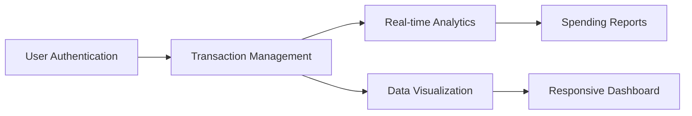

# BudgetApp 💰 - Personal Finance Tracker

[](https://php.net/)
[](https://mysql.com)
[](https://opensource.org/licenses/MIT)

A complete web application for tracking income and expenses with secure authentication, transaction categorization, and spending analytics.

## 🌟 Features


---

## 📌 Hauptfunktionen

✅ **Transaktionen erfassen**  
Füge Einnahmen oder Ausgaben mit Datum, Betrag, Art, Kategorie und Beschreibung hinzu.

📁 **Kategorien & Typen verwalten**  
Wähle bei jeder Transaktion eine passende Kategorie und Art (z. B. „Einnahme“ oder „Ausgabe“).

📊 **Tabelle mit allen Einträgen**  
Die gespeicherten Transaktionen werden in einer optisch strukturierten Tabelle dargestellt.

📈 **Analysefunktion (in Entwicklung)**  
Eigene Seite zur Auswertung deiner Finanzen (z. B. Filter, Diagramme etc.).

👤 **Benutzerprofil & Session-Login**  
Nur eingeloggte Nutzer:innen haben Zugriff auf die App. Sessions werden per `$_SESSION` kontrolliert.

🚪 **Logout-Funktion**  
Beendet die Session und leitet zur Startseite weiter.

---

## 📸 Screenshot


---

## 🛠️ Verwendete Technologien

| Technologie | Beschreibung |
|------------|--------------|
| PHP        | Backend-Logik, Session-Management, Datenbankzugriffe |
| MySQL      | Speicherung der Transaktionen, Kategorien und Nutzerinformationen |
| HTML/CSS   | Struktur und Gestaltung der Oberfläche |
| JavaScript | Dynamisches Nachladen der Kategorien (via `script.js`) |


## 🗃️ Projektstruktur

```mermaid
%%{init: {'theme': 'neutral', 'themeVariables': { 'primaryColor': '#f5f5f5'}}}%%

flowchart TD
    A["index.php"] -->|Redirects to| B["transaktion.php"]
    B -->|Submits to| C["projekt.php"]
    C -->|Updates| D[(MySQL Database)]
    
    subgraph "PHP Files"
        A
        B
        C
        E["analis.php"]
        F["profil.php"]
        G["aus.php"]
    end
    
    subgraph "Assets"
        H["script.js"] --> B
        I["style/style.css"] --> B
        I --> A
        I --> E
        I --> F
    end
    
    subgraph "Documentation"
        J["README.md"]
    end
    
    B -->|AJAX Calls| H
    D -->|Feeds Data| E
    G -->|Clears| A
    F -->|Manages| D

    classDef php fill:#8892BF,color:white,stroke:#555;
    classDef js fill:#F7DF1E,stroke:#555;
    classDef css fill:#2965F1,color:white,stroke:#555;
    classDef db fill:#00758F,color:white,stroke:#555;
    classDef doc fill:#85EA2D,stroke:#555;
    
    class A,B,C,E,F,G php;
    class H js;
    class I css;
    class D db;
    class J doc;

